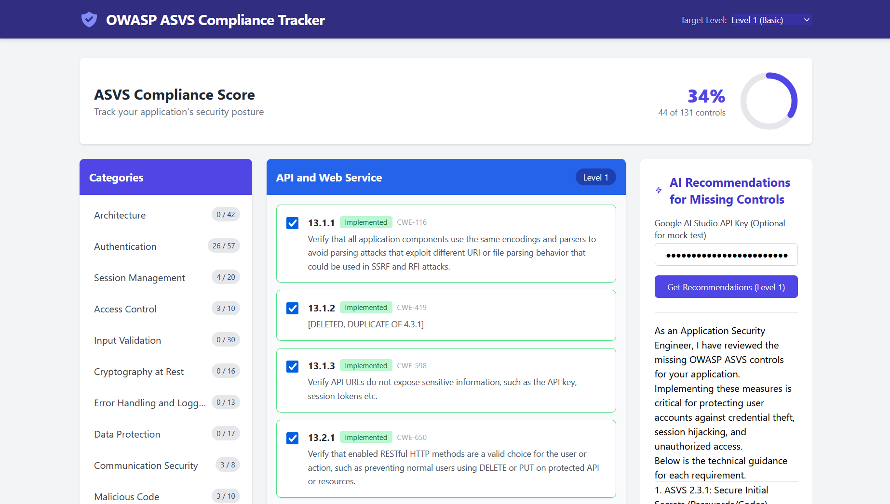

# OWASP ASVS Compliance Tracker

The OWASP ASVS Compliance Tracker is a modern, responsive Angular application designed to help developers and security engineers interact with the [OWASP Application Security Verification Standard (ASVS) v4.0.3](https://owasp.org/www-project-application-security-verification-standard/). 

It provides an intuitive interface to assess application security posture across different verification levels and integrates with Generative AI to provide actionable remediation advice for missing controls.

 
## Features

- **Dynamic Checklist**: Based directly on the official OWASP ASVS checklist matrix.
- **Level Targeting**: Easily switch between ASVS Level 1 (Basic), Level 2 (Standard), and Level 3 (Advanced). The checklist auto-filters applicable requirements.
- **Progress Tracking**: Real-time compliance score calculation and visual progress ring based on the selected requirements.
- **AI Security Recommendations**: Integration with Google AI Studio (Gemini). Send your unselected (missing) security controls to the AI and receive detailed, formatted advice on:
  - What you need to implement.
  - Conceptual "How-To" guides.
  - Important security best practices.

## Technologies Used

- **Framework**: [Angular 17+](https://angular.dev/) (Standalone Components)
- **Styling**: [Tailwind CSS](https://tailwindcss.com/)
- **State Management**: RxJS (BehaviorSubjects)
- **Data Source**: Converted and cleaned JSON generated from the official OWASP ASVS `.xlsx` releases.
- **Markdown Parsing**: `marked` (for rendering structured AI responses)

## Getting Started

### Prerequisites

- [Node.js](https://nodejs.org/) (v18 or higher recommended)
- [Angular CLI](https://angular.dev/tools/cli) installed globally (`npm install -g @angular/cli`)

### Installation

1. Clone or download this repository.
2. Navigate into the application directory:
   ```bash
   cd asvs-app
   ```
3. Install the dependencies:
   ```bash
   npm install
   ```

### Running the Application

To start the local development server:

```bash
npm run start
```
...or alternatively:
```bash
ng serve
```

Navigate to `http://localhost:4200/` in your browser. The application will automatically reload if you change any of the source files.

## AI Integration (Optional)

To fully utilize the **AI Recommendations** feature, you will need an API Key from Google AI Studio.

1. Get an API key from [Google AI Studio](https://aistudio.google.com/).
2. Paste the API key into the input field under the **AI Recommendations** panel in the app.
3. If no API key is provided, the application safely mocks an AI response to demonstrate the intended behavior.

## Project Structure Highlights

- `src/assets/asvs.json`: The raw ASVS dataset used to populate the UI.
- `src/app/services/checklist.service.ts`: Core application state taking care of item selections and level-based score calculations.
- `src/app/services/ai.service.ts`: Handles the external fetch API requests to the Google Gemini models.
- `src/app/components/`: Contains all standalone UI components (`category-list`, `checklist-view`, `score-dashboard`, `ai-recommendations`).

## Building for Production

Run `ng build` to build the project. The build artifacts will be stored in the `dist/` directory.

```bash
npm run build
```

## Contributing

This tool was created to simplify adherence to standard application safety metrics. If you have structural improvements or updates to the base `asvs.json` mappings, feel free to submit pull requests!
